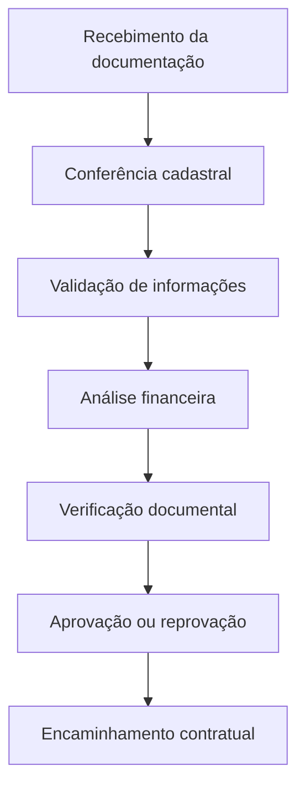

# Análise Cadastral Imobiliária

## Sobre o projeto

Este repositório tem como objetivo documentar e estruturar o fluxo operacional de análise cadastral aplicado ao processo de locação imobiliária.

O projeto foi desenvolvido com foco em:

- organização de processos
- validação documental
- conferência de informações
- padronização operacional
- análise de dados cadastrais
- controle de fluxo administrativo

---

## Objetivos

- Estruturar o processo de análise cadastral
- Demonstrar lógica analítica aplicada ao setor imobiliário
- Organizar etapas operacionais de validação
- Documentar processos administrativos
- Desenvolver projetos voltados para análise operacional e dados

---

## Fluxo Operacional

---

## Etapas da análise

### 1. Recebimento documental
- Coleta de documentos
- Organização de arquivos
- Verificação inicial

### 2. Conferência cadastral
- Dados pessoais
- Dados financeiros
- Compatibilidade das informações

### 3. Validação documental
- Conferência de autenticidade
- Padronização de documentos
- Análise de consistência

### 4. Análise operacional
- Critérios de aprovação
- Organização do fluxo
- Encaminhamento interno

---

## Ferramentas e conhecimentos aplicados

- Excel
- Organização de dados
- Validação documental
- Estruturação de processos
- GitHub
- Lógica analítica
- Fluxo operacional

---

## Próximos passos

- Desenvolvimento de dashboards
- Aplicação de Power BI
- Estruturação de KPIs
- Automação com Python
- Consultas SQL
- Indicadores operacionais

---

## Objetivo profissional

Este projeto também faz parte da minha transição para a área de Análise de Dados, utilizando experiências operacionais reais para desenvolver raciocínio analítico, documentação técnica e estruturação de processos.
